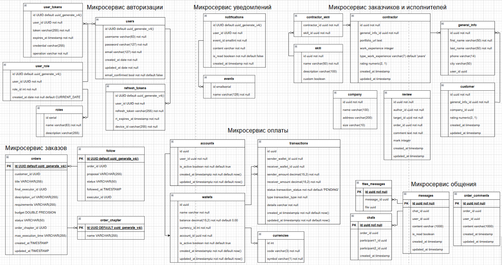

# DevFlow - платформа IT-фриланса

## Обзор проекта

DevFlow - веб-платформа для поиска и выполнения IT-проектов, ориентированная на безопасное взаимодействие между заказчиками и фриланс-разработчиками

Проект решает ключевые проблемы рынка IT-фриланса:
- низкий уровень доверия между сторонами
- риски неоплаты и срыва сроков
- слабую прозрачность требований и качества кода
- отсутствие удобных инструментов управления проектом

Система реализована в виде **микросервисной архитектуры** и предназначена для масштабирования и дальнейшего развития

## Цели и задачи проекта

### Цели
- Практика полного жизненного цикла разработки ПО
- Проектирование и реализация микросервисной архитектуры
- Разработка API для взаимодействия сервисов
- Создание безопасной системы авторизации и платежей

### Задачи
- Анализ предметной области IT-фриланса
- Проектирование архитектуры системы
- Формирование требований и моделей данных
- Реализация ключевых пользовательских сценариев
- Тестирование и документирование решения

## Заинтересованные стороны (Stakeholders)

### Внешние
- **Заказчики** - компании, стартапы, индивидуальные предприниматели
- **Фрилансеры** - разработчики, DevOps, QA, дизайнеры
- **Платёжные системы**
- **Партнёрские сервисы** (GitHub, Figma и др.)

### Внутренние
- Команда разработки
- Аналитики
- Менеджеры проекта

## Основные пользовательские роли

- **Заказчик** - создаёт заказы, выбирает исполнителей, оплачивает работу
- **Исполнитель** - откликается на заказы, выполняет задачи, получает оплату
- **Администратор** - управляет платформой, модерацией и справочниками

## Функциональные возможности системы

### Работа с пользователями
- Регистрация и авторизация (JWT access/refresh, OAuth2)
- Подтверждение электронной почты
- Профили пользователей с рейтингами и отзывами
- Раздельные рейтинги для ролей заказчика и исполнителя

### Управление заказами
- Создание заказов и изменение их статусов:
    - на рассмотрении
    - ожидает оплаты
    - выполняется
    - завершён
- Подписка на заказы
- Предложение условий выполнения задания исполнителем
- Выбор исполнителя заказчиком

### Коммуникации
- Комментарии под открытыми заказами
- Приватные чаты в рамках выполнения заказа
- Общий чат платформы
- Передача результатов работы через чат

### Платежи
- Безопасные переводы между счетами пользователей
- Поддержка нескольких валют (RUB, USD, EUR, GBP, KZT, UAH)
- Конвертация валют через внешнее API
- Комиссия на вывод средств
- Частичная оплата и этапы выполнения

### Уведомления
- Уведомления о сообщениях
- Уведомления о статусах заказов и оплат
- Уведомления о выборе исполнителя

## Архитектура системы

Система реализована в виде набора микросервисов

### Технологический стек
- **Backend:** Spring Boot 3
- **Security:** Spring Security 6, JWT, OAuth2
- **Service Discovery:** Consul
- **Inter-service communication:** OpenFeign
- **Message Broker:** RabbitMQ
- **Databases:**
    - PostgreSQL
    - MongoDB
    - Redis
    - MinIO
- **Infrastructure:** Docker, Liquibase
- **Documentation:** Swagger
- **Monitoring & Logging:** logging starter

### Микросервисы системы
- Сервис авторизации
- Сервис пользователей (заказчики / исполнители)
- Сервис заказов
- Сервис оплаты
- Сервис уведомлений
- Сервис общения

## Use Cases

## Варианты использования (Use Cases)

Ниже представлены основные сценарии работы пользователей на платформе фриланс-биржи.

### 1. Регистрация и Авторизация

#### 1.1 Регистрация пользователя
- **Действующее лицо:** Новый пользователь
- **Цель:** Создать учетную запись на платформе
- **Предусловие:** Пользователь хочет использовать функционал платформы
- **Основной поток:**
    1. Пользователь переходит на страницу регистрации.
    2. Вводит email, пароль, подтверждение пароля, имя.
    3. Система проверяет уникальность email и корректность данных.
    4. Создается учетная запись.
    5. (Опционально) Отправляется письмо с подтверждением.
    6. Пользователь перенаправляется на страницу входа.
- **Альтернативные потоки:**
    - Email уже занят → вывод сообщения об ошибке.
    - Некорректный email или пароль → сообщение с требованиями.
    - Ошибка БД при создании аккаунта → сообщение об ошибке.

#### 1.2 Авторизация пользователя
- **Действующее лицо:** Зарегистрированный пользователь
- **Цель:** Войти в учетную запись
- **Предусловие:** Пользователь имеет учетную запись
- **Основной поток:**
    1. Переход на страницу входа.
    2. Ввод email и пароля.
    3. Аутентификация пользователя.
    4. Перенаправление на главную страницу или профиль.
- **Альтернативные потоки:**
    - Неверный email или пароль → сообщение об ошибке.
    - Слишком много неудачных попыток → временная блокировка.

### 2. Профиль пользователя

#### 2.3 Создание профиля
- **Действующее лицо:** Зарегистрированный пользователь
- **Цель:** Создать профиль с необходимой информацией
- **Предусловие:** Пользователь авторизован
- **Основной поток:**
    1. Переход на страницу создания профиля.
    2. Выбор роли: Заказчик или Исполнитель.
    3. Заполнение информации о себе (компания, контактные данные, портфолио, опыт, расценки).
    4. Проверка корректности данных.
    5. Сохранение профиля.
    6. При необходимости заполнение информации для другой роли.
    7. Перенаправление на профиль пользователя.
- **Альтернативные потоки:**
    - Некорректные данные → сообщение об ошибке.

### 3. Управление заказами

#### 3.4 Создание заказа
- **Действующее лицо:** Зарегистрированный пользователь
- **Цель:** Создать новый заказ
- **Предусловие:** Пользователь авторизован как заказчик
- **Основной поток:**
    1. Переход на страницу создания заказа.
    2. Заполнение деталей заказа (название, описание, требования, бюджет, сроки, файлы).
    3. Проверка корректности данных.
    4. Создание заказа и присвоение ID.
    5. Публикация заказа.
    6. Уведомление потенциальных исполнителей.
- **Альтернативные потоки:**
    - Ошибка валидации данных → сообщение об ошибке.

#### 3.5 Поиск заказа по фильтрам
- **Действующее лицо:** Зарегистрированный пользователь
- **Цель:** Найти заказы по критериям
- **Основной поток:**
    1. Переход на страницу поиска.
    2. Выбор фильтров (статус, специализация, бюджет, ключевые слова).
    3. Вывод результатов.
- **Альтернативные потоки:**
    - Нет результатов → сообщение "Заказы не найдены".
    - Ошибка базы данных → сообщение об ошибке.

#### 3.6 Отклик на заказ и чат
- **Действующее лицо:** Исполнитель
- **Цель:** Откликнуться на заказ и начать общение
- **Основной поток:**
    1. Исполнитель видит заказ.
    2. Нажимает "Откликнуться".
    3. Проверка, не откликался ли ранее.
    4. Создание записи об отклике.
    5. Уведомление заказчика.
    6. Открытие чата.
    7. Согласование сроков и оплаты.
    8. Перевод средств на внутренний счет (оплата частями или полностью).
- **Альтернативные потоки:**
    - Не удалось перевести средства → сообщение об ошибке.

#### 3.7 Изменение статуса заказа
- **Действующее лицо:** Заказчик или Исполнитель
- **Цель:** Обновить статус заказа
- **Основной поток:**
    1. Изменение статуса ("В работе", "Завершен", "Отменен", "Оплачен").
    2. Проверка корректности перехода.
    3. Обновление базы данных.
    4. Уведомление участников.

### 4. Оплата и подписки

#### 4.8 Оплата заказа по частям
- **Действующее лицо:** Заказчик
- **Цель:** Оплатить заказ частями
- **Основной поток:**
    1. Расчет сумм платежей.
    2. Исполнитель отправил часть работы.
    3. Проверка работы заказчиком.
    4. Утверждение и изменение статуса.
    5. Перевод части суммы исполнителю.
    6. Регистрация платежа.
- **Альтернативные потоки:**
    - Работа не принята → статус "На доработке".
    - Не удалось перевести средства → сообщение об ошибке.

#### 4.9 Подписка на заказ или пользователя
- **Действующее лицо:** Пользователь
- **Цель:** Получать уведомления
- **Основной поток:**
    1. Поиск заказа или пользователя.
    2. Нажатие "Подписаться".
    3. Регистрация подписки.
    4. Получение уведомлений об изменениях.

#### 4.10 Премиум-подписка
- **Действующее лицо:** Пользователь
- **Цель:** Доступ к дополнительным функциям
- **Основной поток:**
    1. Переход на страницу премиум-подписки.
    2. Выбор тарифа.
    3. Оплата.
    4. Активация подписки.
- **Альтернативные потоки:**
    - Не удалось оплатить → сообщение об ошибке.

### 5. Служба поддержки

#### 5.11 Обращение в службу поддержки
- **Действующее лицо:** Пользователь
- **Цель:** Получить помощь
- **Основной поток:**
    1. Переход на страницу обратной связи.
    2. Заполнение формы с описанием проблемы.
    3. Отправка сообщения в поддержку.
    4. Получение ответа от службы поддержки.

## Модели и диаграммы

### IDEF1X (модель данных)

## Ограничения и допущения
- Платформа ориентирована только на IT-проекты.
- Мобильное приложение не входит в MVP.
- Расширенная аналитика запланирована после запуска.

## Дополнительная документация

Полный комплект проектной документации доступен по ссылке:

**Google Drive:**  
https://drive.google.com/drive/folders/1LL09gH3Ml0GFQZLfL4sa4OoKSK5l-MP