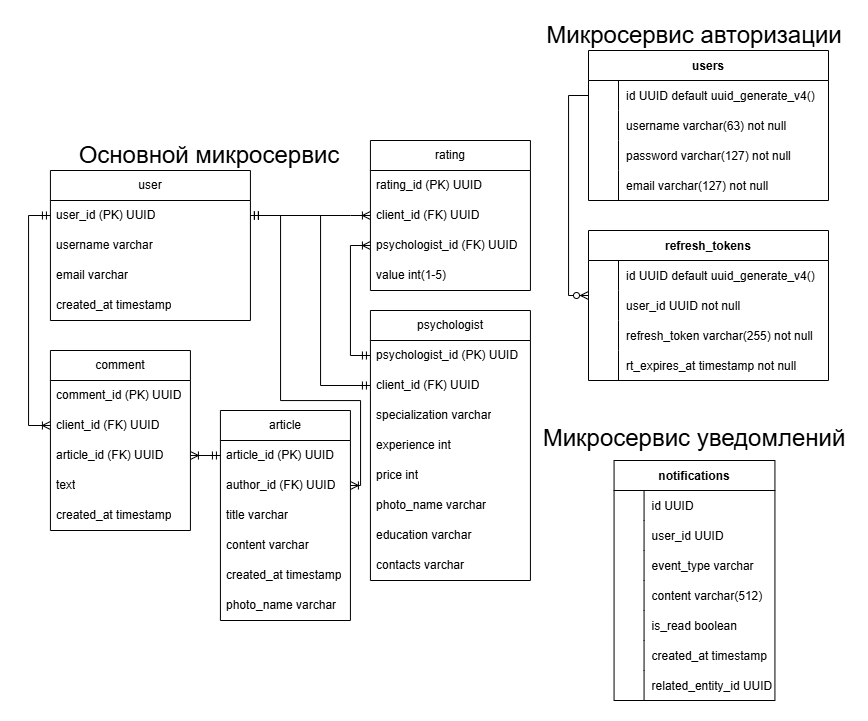

# Модель данных

Основные сущности:
- User
- Psychologist
- Article
- Comment
- Rating
- Notification

Связи:
- User ↔ Article
- User ↔ Comment
- Article ↔ Comment
- Psychologist ↔ Rating
- Psychologist ↔ User
- User ↔ Rating

