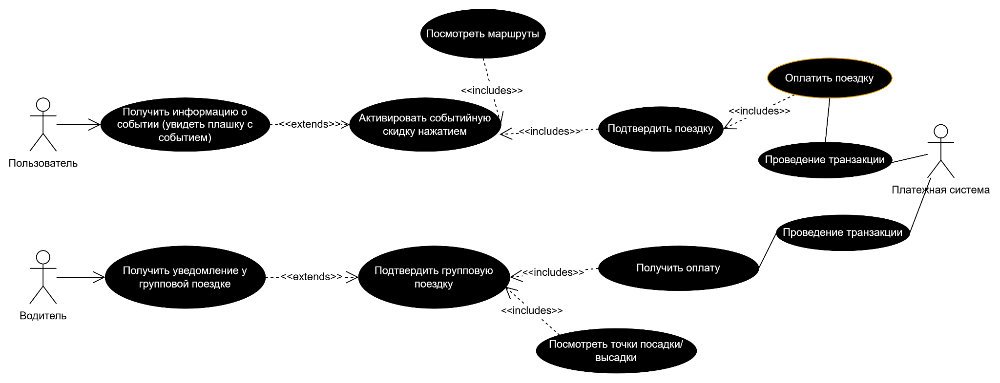
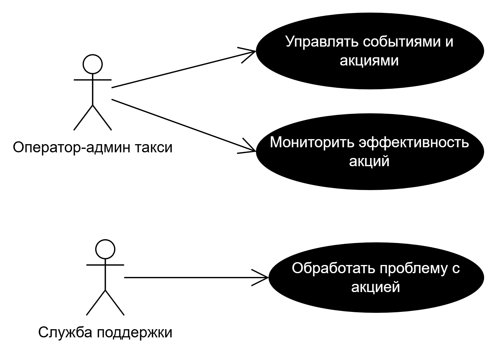
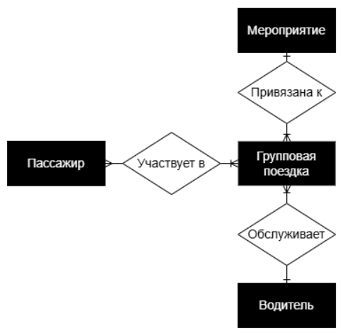
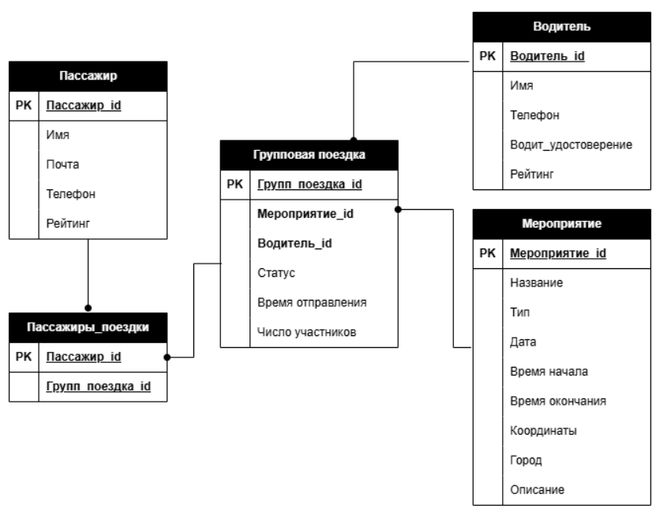
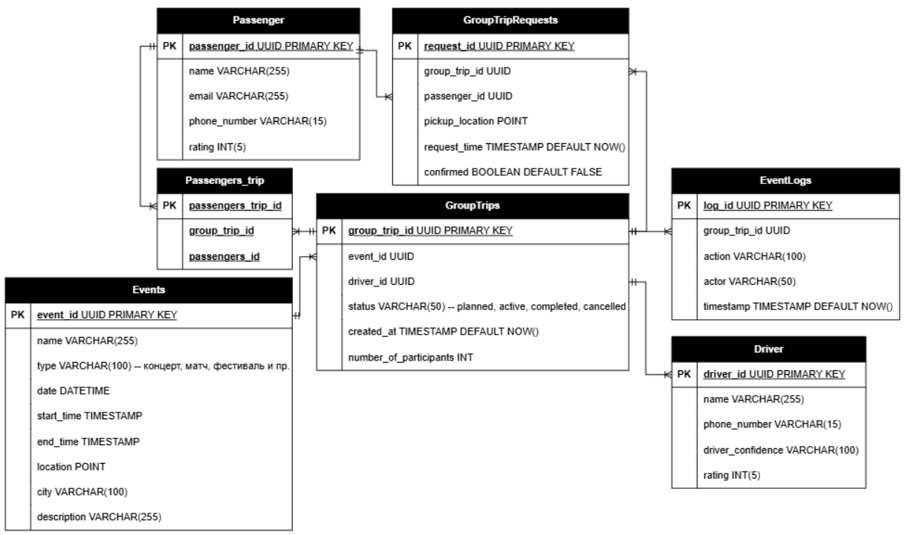
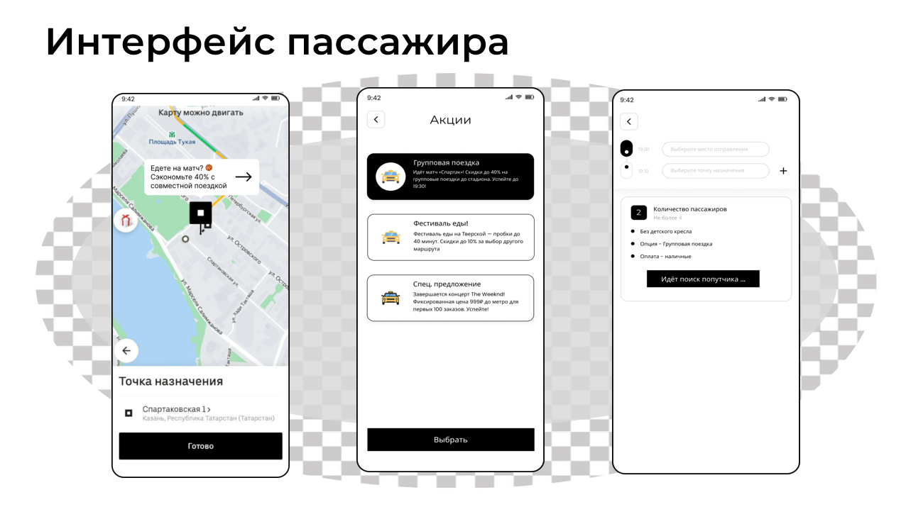
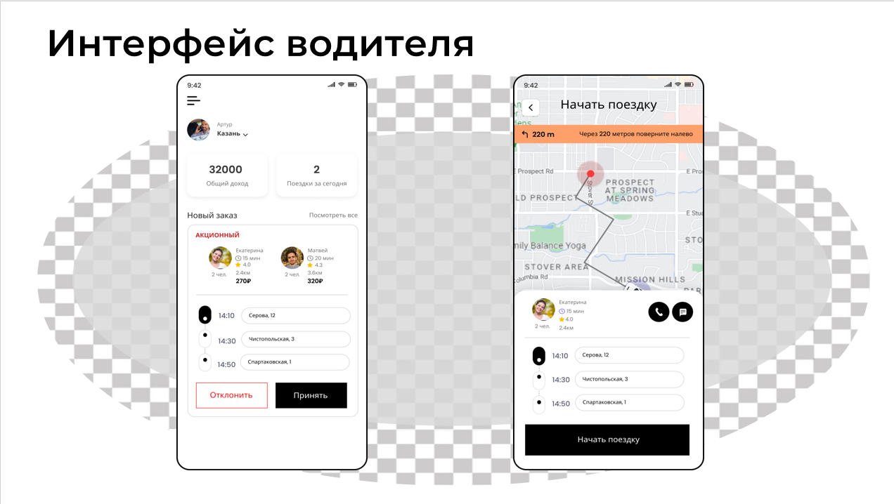
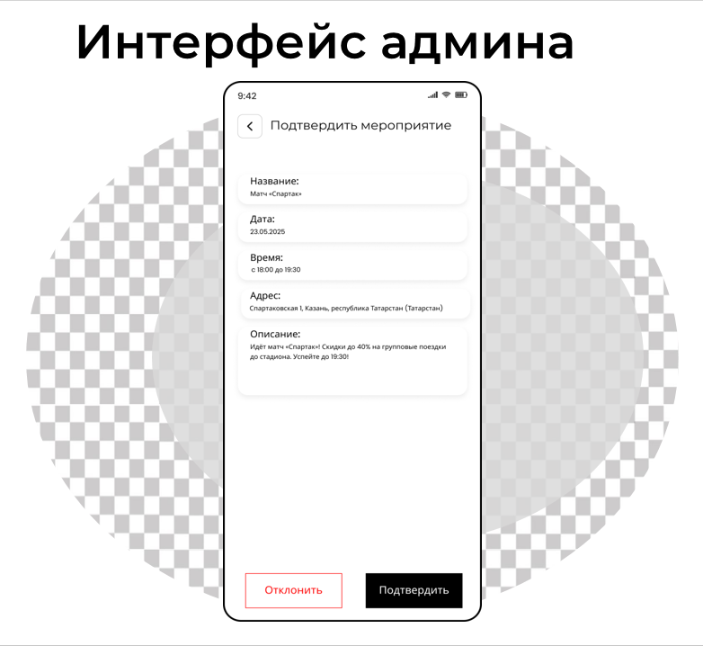

# Групповые поездки на основе событий (Uber Feature)

## Обзор
Данный проект описывает функциональное расширение сервиса Uber — **групповые поездки на основе событий**.  
Фича предназначена для пользователей, направляющихся на одно и то же мероприятие (концерты, спортивные матчи, фестивали), и позволяет автоматически объединять их в группы для совместной поездки.

Основные цели решения:
- снижение стоимости поездки за счет разделения маршрута;
- упрощение логистики для пассажиров;
- повышение эффективности распределения спроса для водителей в периоды массовых мероприятий.

Функциональность реализуется как **надстройка над существующим приложением Uber**, а не как отдельный сервис с нуля.

## Идея решения

### Суть фичи
Пользователи, направляющиеся на одно и то же событие, автоматически объединяются в небольшие группы, после чего система:
- предлагает групповую поездку прямо в приложении;
- рассчитывает оптимальный маршрут с учетом точек посадки и высадки;
- применяет динамическую скидку.

### Общий сценарий работы
1. Система получает данные о событиях в городе через внешний сервис.
2. Пользователям, находящимся рядом с местом проведения мероприятия, предлагается групповая поездка.
3. Пользователь подтверждает участие одним нажатием.
4. Uber формирует группу и строит оптимальный маршрут.
5. Водитель получает готовый маршрут и рекомендации по посадке и высадке.

## Стейкхолдеры

### Пассажиры
Конечные пользователи услуги, заинтересованные в:
- получении скидок и бонусов;
- быстром и удобном заказе поездки на мероприятие;
- возможности разделить стоимость поездки с другими участниками;
- простом пользовательском интерфейсе без ручного ввода промокодов.

### Водители
Поставщики услуги, заинтересованные в:
- увеличении количества заказов и дохода в периоды высокого спроса;
- четком понимании, где и когда ожидается повышенный спрос;
- предсказуемых маршрутах и снижении времени простоя;
- стабильной работе приложения при высоком трафике.

### Внутренние стейкхолдеры
- Продуктовые менеджеры
- Маркетинг
- Операционный отдел
- Поддержка клиентов
- Отдел аналитики

### Внешние стейкхолдеры
- Партнёры и организаторы мероприятий

## Функциональные требования

### Интеграция с сервисами событий
- Подключение к API Яндекс.Афиши или аналогичных платформ.
- Автоматическое получение информации о мероприятиях (место, время, тип события).

### Формирование групп
- Размер группы: от 2 до 4 пассажиров.
- Формирование групп на основе геолокации и направления поездки.

### Маршрутизация
- Построение оптимального маршрута с учетом точек посадки и высадки.
- Максимальное время ожидания пассажиров — **не более 10 минут**.

### Система скидок
- Базовая скидка для групповых поездок: **10–20%**.
- Динамическое увеличение скидки до **30–40%** при:
    - низком спросе;
    - высокой загрузке сервиса;
    - необходимости перераспределения водителей.

### Уведомления
- Push-уведомления пассажирам о доступной групповой поездке.
- Баннер на главном экране приложения.
- Дублирование информации в разделе «Акции».

## User Stories

- **Как водитель**, я хочу получать уведомления о событиях в городе и прогнозируемом спросе, чтобы планировать свое время и перемещаться в зоны повышенного спроса.
- **Как пассажир**, я хочу видеть предложение групповой поездки со скидкой при поездке на событие, чтобы снизить стоимость поездки.
- **Как пассажир**, я хочу активировать предложение одним нажатием из уведомления или специального раздела, чтобы не тратить время на поиск и ввод промокодов.
- **Как водитель**, я хочу видеть рекомендованные точки посадки и высадки возле мероприятий, чтобы минимизировать время ожидания и сложности с навигацией.

### Use Case диаграмма

### UC1. Получение и использование скидки на событие (Пассажир)

**Актор:** Пассажир (пользователь приложения Uber)  
**Цель:** Получить и применить персонализированную скидку на поездку до/от места проведения события.

#### Предусловия
- Пользователь авторизован в приложении Uber.
- Включены push-уведомления и доступ к геолокации.
- Система Uber определила событие и активировала акцию на основе партнерских и аналитических данных.

#### Основной поток
1. Система Uber идентифицирует предстоящее событие в городе пользователя (например, матч через несколько часов).
2. Система определяет релевантных пользователей, которые:
    - указали место события как пункт назначения;
    - находятся географически рядом с местом события;
    - ранее искали информацию о событии или добавляли его в календарь;
    - регулярно совершают поездки в данную зону в аналогичное время.
3. Система формирует персонализированное предложение (например, скидка или групповая поездка) и отображает его в виде плашки или push-уведомления.
4. Пользователь нажимает на предложение и переходит на экран бронирования, где:
    - адрес назначения заполнен автоматически;
    - предложен релевантный тип поездки (включая групповую);
    - скидка уже применена и отображается в итоговой цене;
    - показаны рекомендованные маршруты.
5. Пользователь подтверждает заказ поездки.
6. Система обрабатывает заказ и назначает водителя.

#### Альтернативные потоки
- **A1:** Пользователь игнорирует уведомление — предложение доступно в разделе «Акции» или «События рядом».
- **A2:** Пользователь изменяет тип поездки — скидка применяется, если доступна для выбранного типа.
- **A3:** Событие отменено — система отзывает активные предложения и уведомляет пользователей.

#### Постусловия
- Пользователь получает поездку по сниженной цене.
- Uber увеличивает спрос в зоне проведения события.

---

### UC2. Оптимизация работы водителя в зоне события

**Актор:** Водитель Uber  
**Цель:** Повысить количество заказов и эффективность работы во время массового мероприятия.

#### Предусловия
- Водитель использует приложение Uber Driver.
- Включены геолокация и push-уведомления.
- Для события активирована специальная акция.

#### Основной поток
1. Система прогнозирует повышенный спрос в районе события за определённое время до его начала и во время проведения.
2. Водителю направляется push-уведомление с информацией:
    - о событии;
    - зоне повышенного спроса;
    - рекомендованных точках ожидания;
    - возможных бонусах.
3. В приложении водителя на карте отображается зона события с индикатором спроса.
4. Водитель перемещается в рекомендованную зону.
5. Система преимущественно предлагает заказы, связанные с мероприятием, с оптимизированными маршрутами.
6. Водитель выполняет поездки.

#### Альтернативные потоки
- **A1:** Водитель игнорирует уведомление и продолжает работу в обычном режиме.
- **A2:** В зоне наблюдается избыток водителей — система динамически корректирует уведомления и бонусные условия.

#### Постусловия
- Водитель выполняет больше заказов за меньшее время.
- Пассажиры получают более быстрый сервис.
- Uber улучшает покрытие в пиковые периоды.

## Бизнес-процесс формирования групповой поездки (BPMN)

Данный бизнес-процесс описывает логику подбора и предложения групповых поездок и партнерских акций, приуроченных к городским мероприятиям.

### Общая логика процесса
Процесс инициируется системой при обнаружении события и включает автоматический анализ релевантности, взаимодействие с партнерами и пользователями, а также обработку решений всех участников.

### Описание процесса

1. Система определяет тип, время и локацию мероприятия и проверяет его релевантность для запуска акций и групповых поездок.
2. Если событие подходит, система запрашивает доступных партнеров (кафе, магазины) и водителей в радиусе **до 1 км** от места проведения.
3. Полученные предложения анализируются:
    - условия скидок от партнеров;
    - возможность формирования групповых поездок.
4. На основе анализа система формирует пакет релевантных предложений и направляет **push-уведомления** пользователям.
5. Пользователи могут:
    - принять предложение (скидку или групповую поездку);
    - отклонить его.
6. В случае выбора групповой поездки:
    - водитель получает заявку и подтверждает участие;
    - система формирует оптимальный маршрут и список пассажиров;
    - водитель получает точки посадки и высадки.
7. Партнеры получают запросы от системы и могут:
    - предложить условия скидки;
    - отказаться от участия.
8. Процесс завершается, если:
    - событие признано нерелевантным;
    - пользователь, водитель или партнер отклоняют предложение.

### BPMN

## Концептуальная модель

На концептуальном уровне система включает следующие ключевые сущности и связи:

- Пассажир участвует в групповой поездке
- Водитель обслуживает групповую поездку
- Групповая поездка привязана к конкретному мероприятию

### Концептуальная модель системы

## Логическая модель

- Водитель может обслуживать несколько групповых поездок
- Пассажир может участвовать в нескольких групповых поездках
- В групповой поездке участвует несколько пассажиров
- По поводу 1 мероприятия может быть несколько поездок

### Логическая модель системы

## База данных

- GroupTripRequests — заявки пользователей на групповую поездку
- EventLogs — лог ключевых действий

## Пользовательские интерфейсы

### Интерфейс пассажира

### Интерфейс водителя

### Интерфейс администратора

## Дополнительная документация

Полный комплект проектной документации доступен по ссылке:

**Google Drive:**  
https://drive.google.com/file/d/1MWGbzhFGzJHFr9KBAErBNXjlyMqRtJ3t

В папке размещены:
- техническое задание (ТЗ);
- BPMN-диаграммы бизнес-процессов;
- модели данных;
- программа и методика испытаний (ПМИ)
- презентация проекта
